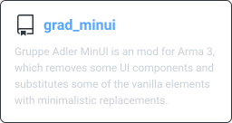

# Gruppe Adler GitHub Index

## Arma 3 Mods

    
    
    
    
    
    

## Arma 3 Libraries

    
    
    
    
    
    

## Topic Guidelines Overview
You can use as much topics as you like, but we ask you to include the fitting topics according to the following guidelines:  
We can't cover all repositories with common topics, but we can try to cover as many as possible. There are categories and modifiers. Each repository can have one category and one or many modifiers.  
I.e. an Arma 3 Coop Mission would have `mission`, `coop` and `arma3` (+ any further topics you like)

### Categories
- Web related repositories: `web` (doesn't matter if NodeBB plugin, backend for an online service or our homepage)
- Mods: `mod`
- Scripting libraries: `library`
- TvT Missions: `mission` and `tvt`
- COOP Missions: `mission` and `coop`
- Test Missions: `mission` and `testmission`

### Modifiers
- Mod / Missions Templates: `template`
- Arma 3 content (mods, libraries, missions): `arma3`
