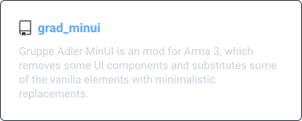

# Gruppe Adler GitHub Index

## Topics
All repositories in this organization should have the appropriate topics to keep the org easily searchable. We can't cover all repositories with common topics, but we can try to cover as many as possible.  
You can use as much topics as you like, but we ask you to at least include the topics according to the following guidelines:  
There are categories and modifiers. Each repository can have one category and any amount of modifiers.  
  
I.e. an Arma 3 Coop Mission would have ,  and  (+ any further topics you like)

### Categories
- Web related repositories:  ([search organization](https://github.com/search?q=org%3Agruppe-adler+topic%3Aweb))
- Mods: ([search organization](https://github.com/search?q=org%3Agruppe-adler+topic%3Amod))
- Scripting libraries:  ([search organization](https://github.com/search?q=org%3Agruppe-adler+topic%3Alibrary))
- TvT Missions:  and  ([search organization](https://github.com/search?q=org%3Agruppe-adler+topic%3Amission+topic%3Atvt))
- COOP Missions:  and  ([search organization](https://github.com/search?q=org%3Agruppe-adler+topic%3Amission+topic%3Acoop))
- Test Missions:  and  ([search organization](https://github.com/search?q=org%3Agruppe-adler+topic%3Amission+topic%3Atestmission))

### Modifiers
- Mod / Missions Templates: 
- Arma 3 content (mods, libraries, missions): 

## Arma 3 Mods ( & )

    
    
    
    
    
    

## Arma 3 Libraries ( & )

    
    
    
    
    
    

