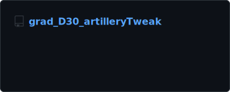
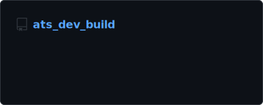
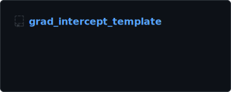
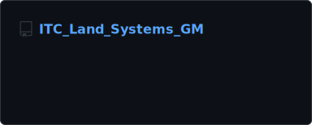
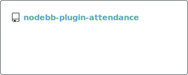
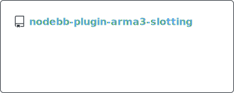
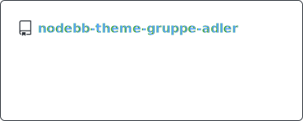
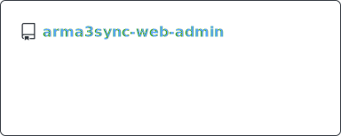

# Gruppe Adler GitHub Index
_This README is auto-generated. Check out the [CONTRIBUTING.md](./CONTRIBUTING.md) for more info._

## Topics
To keep our organization easily searchable we use the following topics:

### Categories
- Web related repositories:  ([search non archived](https://github.com/search?q=org%3Agruppe-adler+topic%3Aweb+archived%3Afalse))
- Mods:  ([search non archived](https://github.com/search?q=org%3Agruppe-adler+topic%3Amod+archived%3Afalse))
- Scripting libraries:  ([search non archived](https://github.com/search?q=org%3Agruppe-adler+topic%3Alibrary+archived%3Afalse))
- TvT Missions:  and  ([search non archived](https://github.com/search?q=org%3Agruppe-adler+topic%3Amission+topic%3Atvt+archived%3Afalse))
- COOP Missions:  and  ([search non archived](https://github.com/search?q=org%3Agruppe-adler+topic%3Amission+topic%3Acoop+archived%3Afalse))
- Test Missions:  and  ([search non archived](https://github.com/search?q=org%3Agruppe-adler+topic%3Amission+topic%3Atest+archived%3Afalse))

### Modifiers
- Mod / Missions Templates:  ([search non archived](https://github.com/search?q=org%3Agruppe-adler+topic%3Atemplate+archived%3Afalse))
- Arma 3 content (mods, libraries, missions):  ([search non archived](https://github.com/search?q=org%3Agruppe-adler+topic%3Aarma3+archived%3Afalse))

## Arma 3 Mods
The list below includes all repositories, which aren't archived, not private and have the following topics:  

Show more

## Arma 3 Libraries
The list below includes all repositories, which aren't archived, not private and have the following topics:  

Show more

## Web related projects
The list below includes all repositories, which aren't archived, not private and have the following topics: 

Show more

## Other popular topics
-  7 repositories ([search non archived](https://github.com/search?q=org%3Agruppe-adler+archived%3Afalse+topic%3Aarma))
-  5 repositories ([search non archived](https://github.com/search?q=org%3Agruppe-adler+archived%3Afalse+topic%3Areforger))
-  5 repositories ([search non archived](https://github.com/search?q=org%3Agruppe-adler+archived%3Afalse+topic%3Agrad-aff))
-  4 repositories ([search non archived](https://github.com/search?q=org%3Agruppe-adler+archived%3Afalse+topic%3Apaa))
-  4 repositories ([search non archived](https://github.com/search?q=org%3Agruppe-adler+archived%3Afalse+topic%3Aarma-reforger))
-  3 repositories ([search non archived](https://github.com/search?q=org%3Agruppe-adler+archived%3Afalse+topic%3Awip))
-  3 repositories ([search non archived](https://github.com/search?q=org%3Agruppe-adler+archived%3Afalse+topic%3Aintercept))
-  3 repositories ([search non archived](https://github.com/search?q=org%3Agruppe-adler+archived%3Afalse+topic%3Aenforce-script))
-  3 repositories ([search non archived](https://github.com/search?q=org%3Agruppe-adler+archived%3Afalse+topic%3Aenfusion))
-  3 repositories ([search non archived](https://github.com/search?q=org%3Agruppe-adler+archived%3Afalse+topic%3Aaction))
-  3 repositories ([search non archived](https://github.com/search?q=org%3Agruppe-adler+archived%3Afalse+topic%3Anodebb))