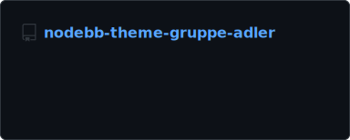
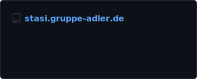

# Gruppe Adler GitHub Index

## Archived repositories
All discontinued projects should be archived. This includes played missions and deprecated libraries.

## Topics
All repositories in this organization should have the appropriate topics to keep the org easily searchable. We can't cover all repositories with common topics, but we can try to cover as many as possible.  
**You can use as many topics as you like, but we ask you to at least include the topics according to the following guidelines:**  
There are categories and modifiers. Each repository can have one category and any amount of modifiers.  
  
i.e. an Arma 3 Coop Mission would have ,  and  (+ any further topics you like)

### Categories
- Web related repositories:  ([search non archived](https://github.com/search?q=org%3Agruppe-adler+topic%3Aweb+archived%3Afalse))
- Mods:  ([search non archived](https://github.com/search?q=org%3Agruppe-adler+topic%3Amod+archived%3Afalse))
- Scripting libraries:  ([search non archived](https://github.com/search?q=org%3Agruppe-adler+topic%3Alibrary+archived%3Afalse))
- TvT Missions:  and  ([search non archived](https://github.com/search?q=org%3Agruppe-adler+topic%3Amission+topic%3Atvt+archived%3Afalse))
- COOP Missions:  and  ([search non archived](https://github.com/search?q=org%3Agruppe-adler+topic%3Amission+topic%3Acoop+archived%3Afalse))
- Test Missions:  and  ([search non archived](https://github.com/search?q=org%3Agruppe-adler+topic%3Amission+topic%3Atest+archived%3Afalse))

### Modifiers
- Mod / Missions Templates:  ([search non archived](https://github.com/search?q=org%3Agruppe-adler+topic%3Atemplate+archived%3Afalse))
- Arma 3 content (mods, libraries, missions):  ([search non archived](https://github.com/search?q=org%3Agruppe-adler+topic%3Aarma3+archived%3Afalse))

## Arma 3 Mods
The list below includes all repositories, which aren't archived, not private and have the following tags:  

Show more

## Arma 3 Libraries
The list below includes all repositories, which aren't archived, not private and have the following tags:  

Show more

## Web related projects
The list below includes all repositories, which aren't archived, not private and have the following tags: 

Show more

## Other popular topics
-  14 repositories ([search non archived](https://github.com/search?q=org%3Agruppe-adler+archived%3Afalse+topic%3Awip))
-  9 repositories ([search non archived](https://github.com/search?q=org%3Agruppe-adler+archived%3Afalse+topic%3Aendgame))
-  7 repositories ([search non archived](https://github.com/search?q=org%3Agruppe-adler+archived%3Afalse+topic%3Amaps))
-  7 repositories ([search non archived](https://github.com/search?q=org%3Agruppe-adler+archived%3Afalse+topic%3Atemplate))
-  5 repositories ([search non archived](https://github.com/search?q=org%3Agruppe-adler+archived%3Afalse+topic%3Agrad-aff))
-  4 repositories ([search non archived](https://github.com/search?q=org%3Agruppe-adler+archived%3Afalse+topic%3Apaa))
-  4 repositories ([search non archived](https://github.com/search?q=org%3Agruppe-adler+archived%3Afalse+topic%3Aarma))
-  4 repositories ([search non archived](https://github.com/search?q=org%3Agruppe-adler+archived%3Afalse+topic%3Aintercept))
-  4 repositories ([search non archived](https://github.com/search?q=org%3Agruppe-adler+archived%3Afalse+topic%3Anodebb))
-  4 repositories ([search non archived](https://github.com/search?q=org%3Agruppe-adler+archived%3Afalse+topic%3Afuel-frenzy))
-  4 repositories ([search non archived](https://github.com/search?q=org%3Agruppe-adler+archived%3Afalse+topic%3Agtv))
-  3 repositories ([search non archived](https://github.com/search?q=org%3Agruppe-adler+archived%3Afalse+topic%3Aadler-base))
-  3 repositories ([search non archived](https://github.com/search?q=org%3Agruppe-adler+archived%3Afalse+topic%3Anodebb-plugin))
-  3 repositories ([search non archived](https://github.com/search?q=org%3Agruppe-adler+archived%3Afalse+topic%3Ahunting-hoppers))
-  3 repositories ([search non archived](https://github.com/search?q=org%3Agruppe-adler+archived%3Afalse+topic%3Aar3play))
-  2 repositories ([search non archived](https://github.com/search?q=org%3Agruppe-adler+archived%3Afalse+topic%3Aaction))
-  2 repositories ([search non archived](https://github.com/search?q=org%3Agruppe-adler+archived%3Afalse+topic%3Aarma3sync))
-  1 repositories ([search non archived](https://github.com/search?q=org%3Agruppe-adler+archived%3Afalse+topic%3Apwa))
-  1 repositories ([search non archived](https://github.com/search?q=org%3Agruppe-adler+archived%3Afalse+topic%3Avuepress))
-  1 repositories ([search non archived](https://github.com/search?q=org%3Agruppe-adler+archived%3Afalse+topic%3Awebcomponent))
-  1 repositories ([search non archived](https://github.com/search?q=org%3Agruppe-adler+archived%3Afalse+topic%3Awebhook))
-  1 repositories ([search non archived](https://github.com/search?q=org%3Agruppe-adler+archived%3Afalse+topic%3Agithub))
-  1 repositories ([search non archived](https://github.com/search?q=org%3Agruppe-adler+archived%3Afalse+topic%3Auserconfig))
-  1 repositories ([search non archived](https://github.com/search?q=org%3Agruppe-adler+archived%3Afalse+topic%3Acba))
-  1 repositories ([search non archived](https://github.com/search?q=org%3Agruppe-adler+archived%3Afalse+topic%3Ahemtt))
-  1 repositories ([search non archived](https://github.com/search?q=org%3Agruppe-adler+archived%3Afalse+topic%3Awebassembly))
-  1 repositories ([search non archived](https://github.com/search?q=org%3Agruppe-adler+archived%3Afalse+topic%3Anodebb-theme))
-  1 repositories ([search non archived](https://github.com/search?q=org%3Agruppe-adler+archived%3Afalse+topic%3Aaddon))
-  1 repositories ([search non archived](https://github.com/search?q=org%3Agruppe-adler+archived%3Afalse+topic%3Anode))
-  1 repositories ([search non archived](https://github.com/search?q=org%3Agruppe-adler+archived%3Afalse+topic%3Apbo))
-  1 repositories ([search non archived](https://github.com/search?q=org%3Agruppe-adler+archived%3Afalse+topic%3Awrp))
-  1 repositories ([search non archived](https://github.com/search?q=org%3Agruppe-adler+archived%3Afalse+topic%3Asqf))
-  1 repositories ([search non archived](https://github.com/search?q=org%3Agruppe-adler+archived%3Afalse+topic%3Aloadout))
-  1 repositories ([search non archived](https://github.com/search?q=org%3Agruppe-adler+archived%3Afalse+topic%3Acivilians))
-  1 repositories ([search non archived](https://github.com/search?q=org%3Agruppe-adler+archived%3Afalse+topic%3Adiscord-bot))
-  1 repositories ([search non archived](https://github.com/search?q=org%3Agruppe-adler+archived%3Afalse+topic%3Asquadxml))
-  1 repositories ([search non archived](https://github.com/search?q=org%3Agruppe-adler+archived%3Afalse+topic%3Aphotoshop))
-  1 repositories ([search non archived](https://github.com/search?q=org%3Agruppe-adler+archived%3Afalse+topic%3Aphotoshop-plugin))
-  1 repositories ([search non archived](https://github.com/search?q=org%3Agruppe-adler+archived%3Afalse+topic%3Aadobe-photoshop-sdk))
-  1 repositories ([search non archived](https://github.com/search?q=org%3Agruppe-adler+archived%3Afalse+topic%3Agimp))
-  1 repositories ([search non archived](https://github.com/search?q=org%3Agruppe-adler+archived%3Afalse+topic%3Agimp-plugin))
-  1 repositories ([search non archived](https://github.com/search?q=org%3Agruppe-adler+archived%3Afalse+topic%3Aexample))
-  1 repositories ([search non archived](https://github.com/search?q=org%3Agruppe-adler+archived%3Afalse+topic%3Adiving))
-  1 repositories ([search non archived](https://github.com/search?q=org%3Agruppe-adler+archived%3Afalse+topic%3Acasual))
-  1 repositories ([search non archived](https://github.com/search?q=org%3Agruppe-adler+archived%3Afalse+topic%3Alythium))
-  1 repositories ([search non archived](https://github.com/search?q=org%3Agruppe-adler+archived%3Afalse+topic%3Afx))
-  1 repositories ([search non archived](https://github.com/search?q=org%3Agruppe-adler+archived%3Afalse+topic%3Aacre))